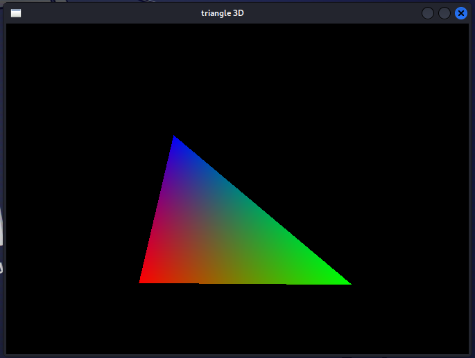
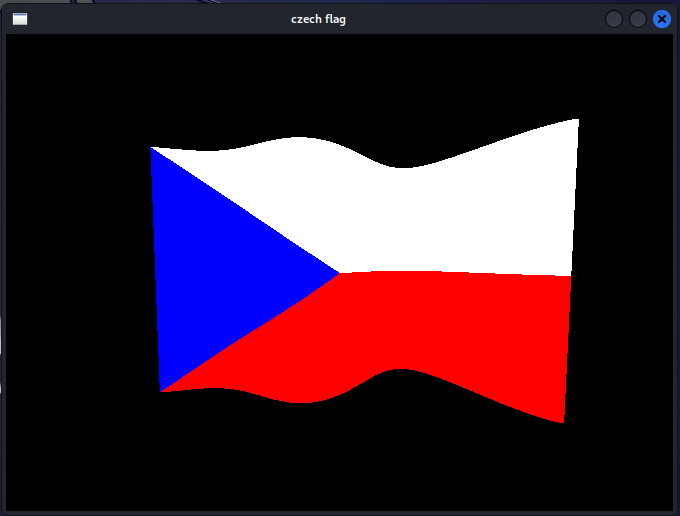
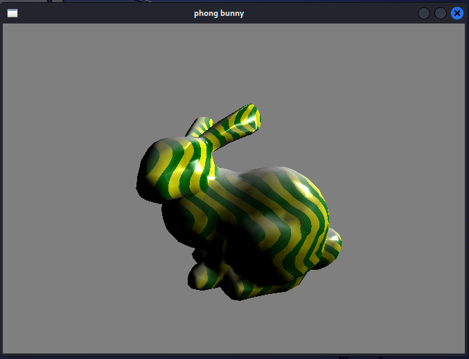

# Virtual-GPU
In this project we dealt with the basic operations of a graphics card on a processor. The code contains a basic pipeline. The project was developed while studying at BUT FIT in the undergraduate program.

## Color interpolation on triangle

## Czech flag animated

## Bunny
